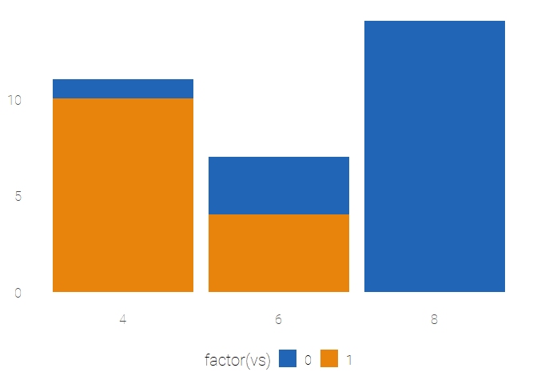
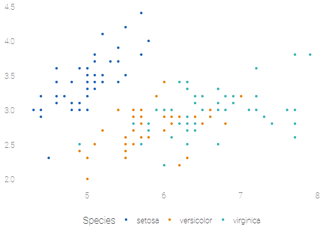

<!-- README.md is generated from README.Rmd. Please edit that file -->

# lockeutils

[](https://www.repostatus.org/#wip)

The goal of lockeutils is to provide some common tools to the Locke Data
team.

## Installation

The repo is private for now so please authenticate yourself, cf
<http://happygitwithr.com/github-pat.html#how-do-you-authenticate-yourself>

``` r
remotes::install_github("lockedata/lockeutils")
```

At the first package loading, `lockeutils` should guide you to install
fonts. We’ll update instructions here based on your experience.

## ggplot2 theme

``` r
library("ggplot2")
library("lockeutils")
df <- data.frame(
gp = factor(rep(letters[1:3], each = 10)),
y = rnorm(30)
)
ggplot(df, aes(gp, y)) +
  geom_point() +
  ggtitle("wow title LHS great",
          subtitle = "nice plot") +
  theme_ld()
```


## colour scale

For no more than 3 classes.

``` r

ggplot(mtcars, aes(factor(cyl), fill = factor(vs))) +
geom_bar() +
theme_ld() +
scale_fill_ld()
```



``` r

ggplot(iris, aes(Sepal.Length, Sepal.Width, color = Species)) +
  geom_point() +
  theme_ld() +
   scale_color_ld()
```



## Colours on their own

``` r
lockeutils::get_ld_colours()
#> # A tibble: 3 x 2
#>   colour_name colour_hex
#>   <chr>       <chr>     
#> 1 orange      #E8830C   
#> 2 blue        #2165B6   
#> 3 grey        #4d4d4d
```

## Contributing

Wanna report a bug or suggest a feature? Great stuff\! For more
information on how to contribute check out [our contributing
guide](.github/CONTRIBUTING.md).

Please note that this R package is released with a [Contributor Code of
Conduct](CODE_OF_CONDUCT.md). By participating in this package project
you agree to abide by its terms.
